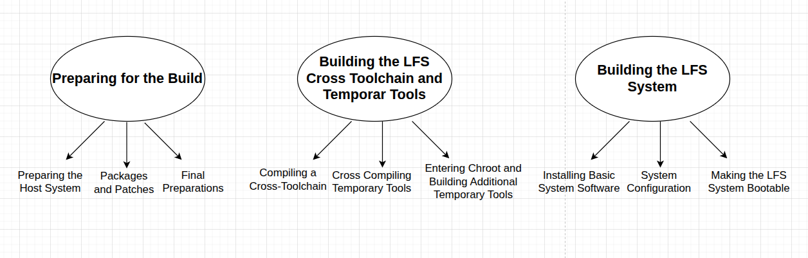

# FT_LINUX

In this project, the goal is to build our own Linux operating system. 

  
   
  <em>Here is the 3 main step for build LFS.</em>

While doing this project all steps created by following accordingly [Linux From Scratch](https://www.linuxfromscratch.org/lfs/view/stable/index.html) handbook. In this tutorial instead of how we did every step for installation, i will explain why we did and what we got. Also for the make it easy to installation part in LFS book you can watch a playlist in [this channel](https://www.youtube.com/@Kernotex/playlists).

While we are creating LFS, we will make some changes on the disk, perform mointing operations or update important botting files on our host machine. Any mistake in this actions can broke the host system. To prevent it i prefer to use virtual machine. Therfore, i set up Ubuntu 22 in VirtualBox and i will use this Ubuntu 22 for my host machine anymore.

### Step1: [Preparing for the Build](readme/PreparingForTheBuild/PreparingForTheBuild.md)

Describes how to prepare for the building process—making a partition, downloading the packages, and compiling temporary tools.

### Step2: [Building the LFS Cross Toolchain and Temporary Tools](readme/CrossToolchain&TemporaryTools/CrossToolchain&TemporaryTools.md)
Provides instructions for building the tools needed for constructing the final LFS system.

### Step3: Building the LFS System
Compiling and installing all the packages one by one, setting up the boot scripts, and installing the kernel.