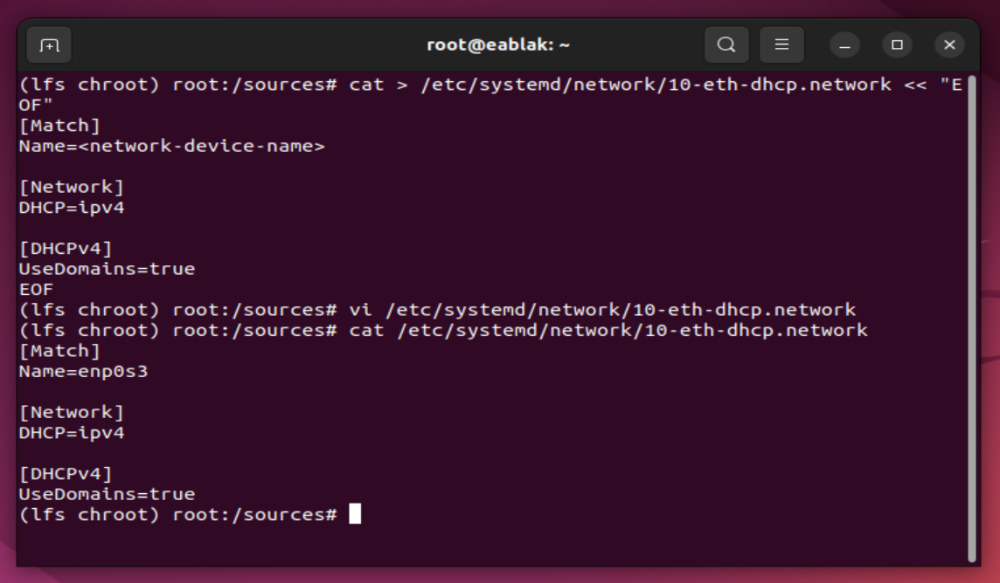
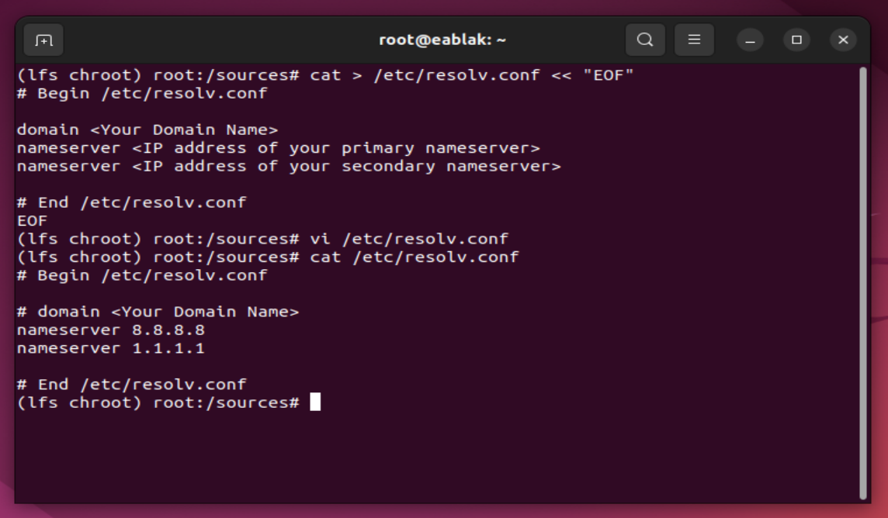
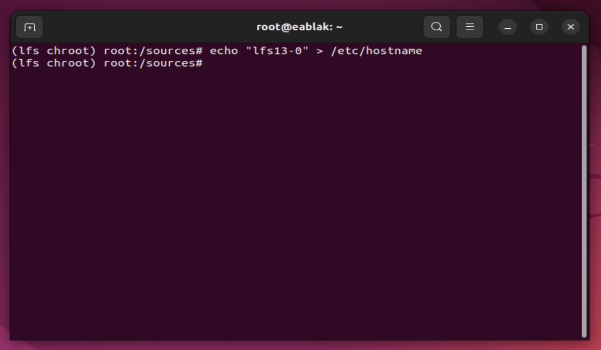
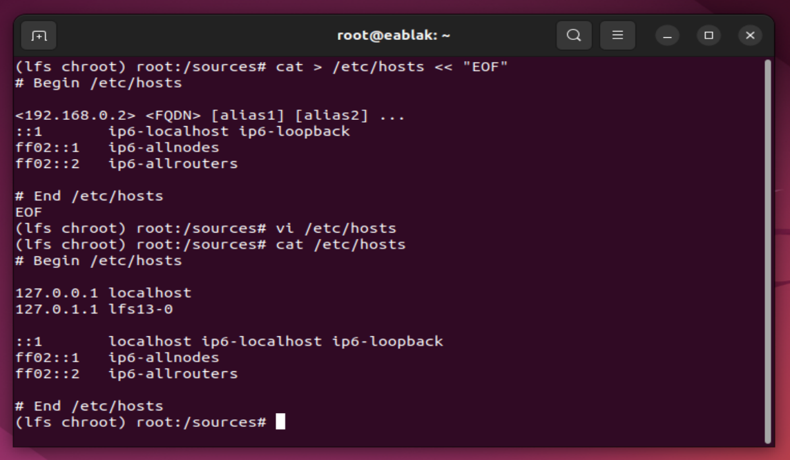
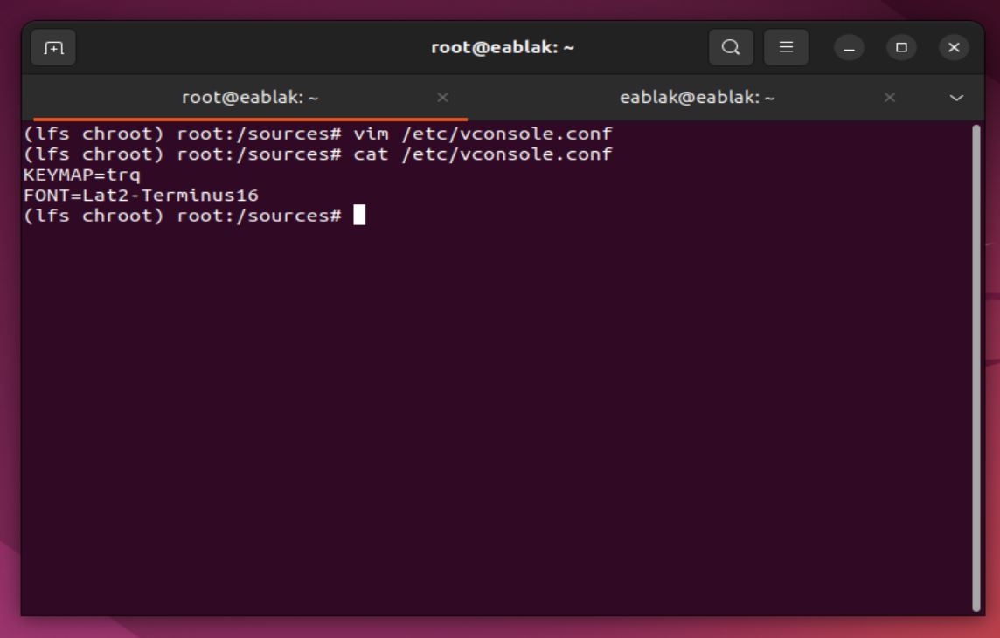
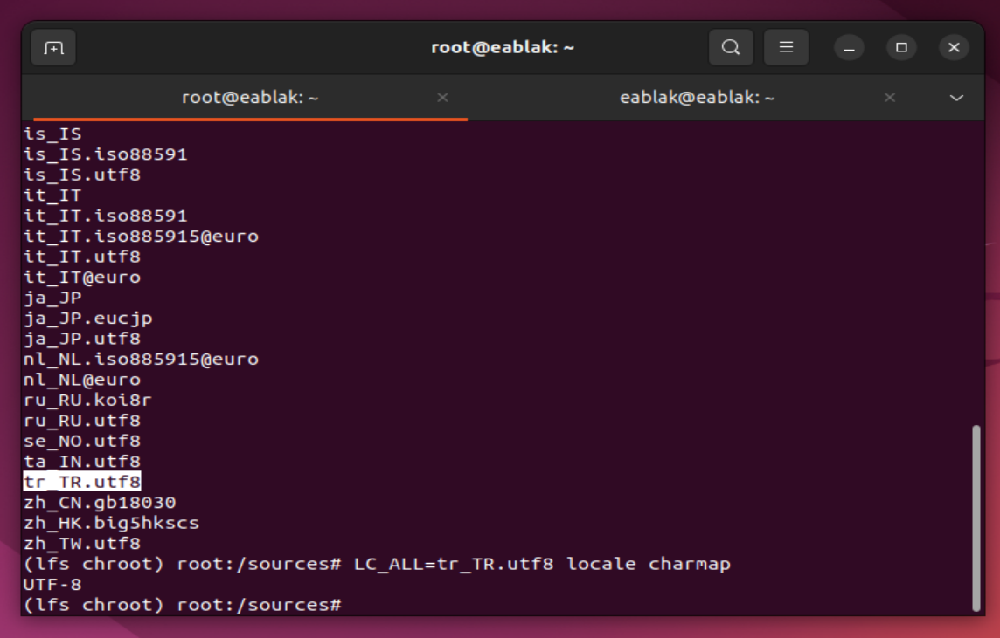
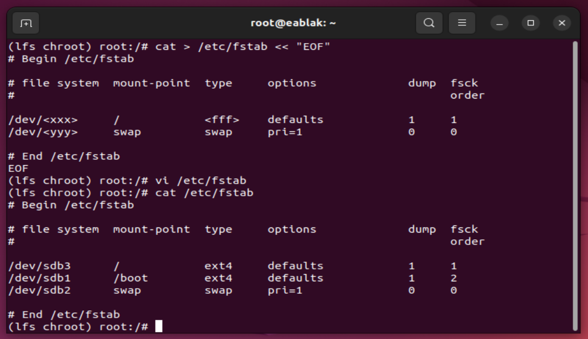
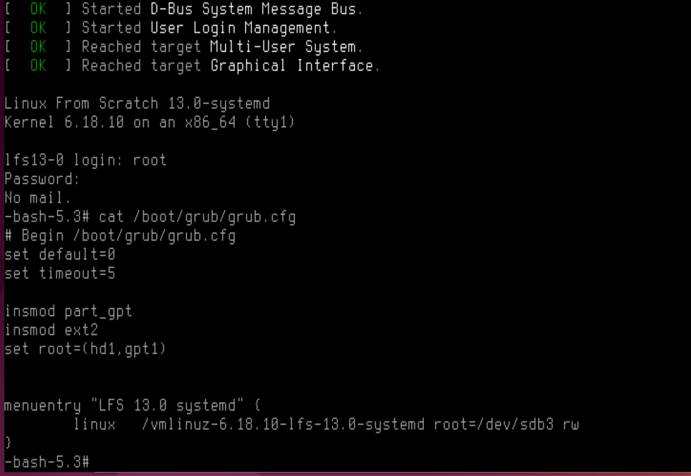

# Building the LFS System

## Chapter 8: Installing Basic System Software

From now on we will start to build real LFS system. So we are starting to compile linux system software.

Follow the [book](https://www.linuxfromscratch.org/lfs/view/stable/chapter08/chapter08.html) and [tutorial1](https://www.youtube.com/watch?v=IYICbwnvd-Q&list=PLyc5xVO2uDsD1rWqX90pmzUZEdRWnM8QU&index=8), [tutorial2](https://www.youtube.com/watch?v=Rrrc84ZCAA4&list=PLyc5xVO2uDsD1rWqX90pmzUZEdRWnM8QU&index=9) and [tutorial3](https://www.youtube.com/watch?v=-viJgVw57eM&list=PLyc5xVO2uDsD1rWqX90pmzUZEdRWnM8QU&index=10) to complete this chapter.

<i>Note: Testings are taking a time. I prefer the skip "8.84. Stripping" chapter.</i>

## Chapter 9: System Configuration

In this chapter we will do system configuration process. This procces contain many tasks. Let's check them some concepts:

<b>Bootscripts</b>: With a set of scripts we will adjust the start/stop LFS system at bootup/shutdown moments. 

The LFS-Bootscripts package contains SysV init style shell scripts. These scripts do various tasks such as check filesystem integrity during boot, load keymaps, set up networks and halt process at shutdown.

<b>Udev</b>: Udev is the Linux subsystem that supplies your computer with device events. That means it's the code that detects when you have things plugged into your computer, like a network card, external hard drives (including USB thumb drives), mouses, keyboards, joysticks and gamepads, DVD-ROM drives, and so on.

<b>Network</b>: With a networking configuration files we will configure system's network settings.

And we will configure terminal and shell with configuration files.

Follow the [book](https://www.linuxfromscratch.org/lfs/view/stable/chapter09/introduction.html) and [tutorial](https://www.youtube.com/watch?v=OfvuYb6dcAE&list=PLyc5xVO2uDsD1rWqX90pmzUZEdRWnM8QU&index=12) to complete this chapter.

Here is how i did my configurations:

<table align="center">
<tr>

<td width="50%" align="center" style="text-align:center;">

</td>

<td width="50%" align="center" style="text-align:center;">

</td>

</tr>
</table>

<table align="center">
<tr>

<td width="50%" align="center" style="text-align:center;">

Hostname must be student login!

</td>

<td width="50%" align="center" style="text-align:center;">

Use your hostname

</td>

</tr>
</table>

<table align="center">
<tr>

<td width="50%" align="center" style="text-align:center;">

</td>

<td width="50%" align="center" style="text-align:center;">

</td>

</tr>
</table>

## Chapter 10: Making the LFS System Bootable

It is time to make the LFS system bootable. This chapter discusses creating the /etc/fstab file, building a kernel for the new LFS system, and installing the GRUB boot loader so that the LFS system can be selected for booting at startup.

Follow the [book](https://www.linuxfromscratch.org/lfs/view/stable/chapter10/chapter10.html) and [tutorial](https://www.youtube.com/watch?v=9Jx8r-fbS5s&list=PLyc5xVO2uDsD1rWqX90pmzUZEdRWnM8QU&index=13) to complete this chapter.

*** 

!! While doing menuconfig configuration processes, named your kernel as "vmlinuz-<linux_version>-<student_login>". and change the rest of the commands accordingly your filename.

    cp -iv arch/x86/boot/bzImage /boot/vmlinuz-6.16.1-lfs-12.4
    cp -iv System.map /boot/System.map-6.16.1
    cp -iv .config /boot/config-6.16.1

***

!! Pdf wants:

- The kernel sources must be in /usr/src/kernel-$(version).
- The kernel version must contain your student login in it. Something like ‘Linux
kernel 4.1.2-<student_login>‘.

But handbook says "/usr/src/linux symlink will not create (it's for old versions). So create your folder with your specific name and move your kernel build folder into there. (Do this process before rebooting)"

***

<i>Note: my system using bios so i follow that commands.</i>

Here is how i did my configurations:

<table align="center">
<tr>

<td width="50%" align="center" style="text-align:center;">

</td>

<td width="50%" align="center" style="text-align:center;">

Use your vmlinuz-linux_version-student_login filename for menuentry linux line

</td>

</tr>
</table>

Now you have a working LFS.