This documentation created accordingly [Linux From Scratch Handbook.](https://www.linuxfromscratch.org/lfs/view/stable/index.html) You can check that one to learn detailly.

# Preparing for the Build

## Chapter 3: Packages and Patches

Now, a list of packages that need to be downloaded in order to build a basic Linux system. 

Downloaded packages and patches will need to be stored somewhere that is conveniently available throughout the entire build. A working directory is also required to unpack the sources and build them. <b>$LFS/sources</b> can be used both as the place to store the tarballs and patches and as a working directory. By using this directory, the required elements will be located on the LFS partition and will be available during all stages of the building process.

<table align="center">
<tr>
<td width="40%" align="center" style="text-align:center;">

To create this directory, execute the following command, as user root, before starting the download session:


```bash
mkdir -v $LFS/sources
```
</td>
<td width="50%" align="center" style="text-align:center;">
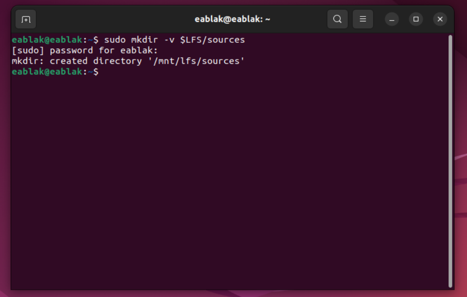</img>

</td>
</tr>
</table>

Make this directory writable and sticky. “Sticky” means that even if multiple users have write permission on a directory, only the owner of a file can delete the file within a sticky directory. 

<table align="center">
<tr>
<td width="40%" align="center" style="text-align:center;">

The following command will enable the write and sticky modes:
```bash
chmod -v a+wt $LFS/sources
```
</td>
<td width="50%" align="center" style="text-align:center;">
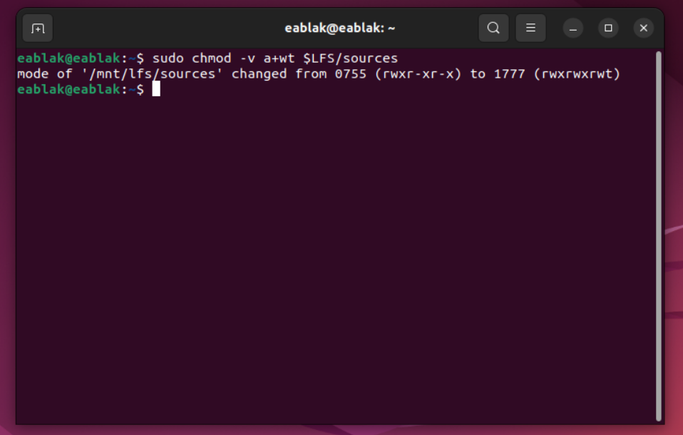</img>

</td>
</tr>
</table>

To be able to download this packages and patches firstly we should fetch those two files and place them in this current created directory:

<table align="center">
<tr>
<td width="50%" align="center" style="text-align:center;">
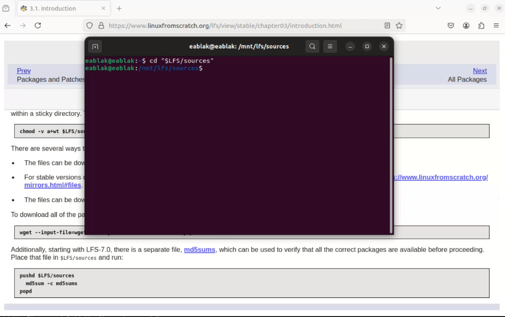</img>
</td>
<td width="50%" align="center" style="text-align:center;">
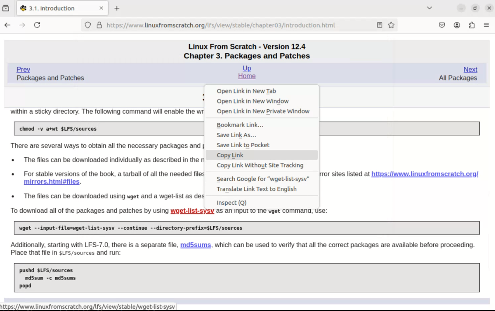</img>
</td>
</tr>
<tr>
<td width="50%" align="center" style="text-align:center;">
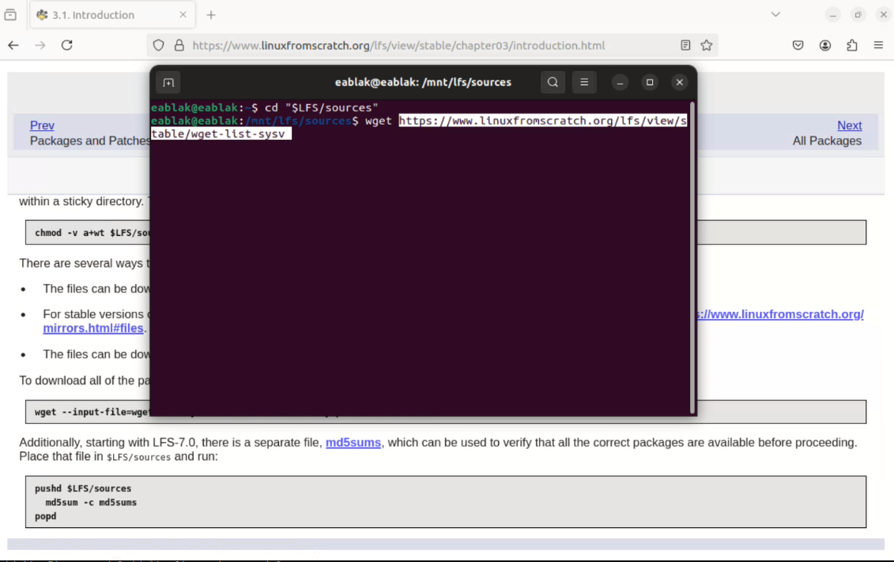</img>
</td>
<td width="50%" align="center" style="text-align:center;">
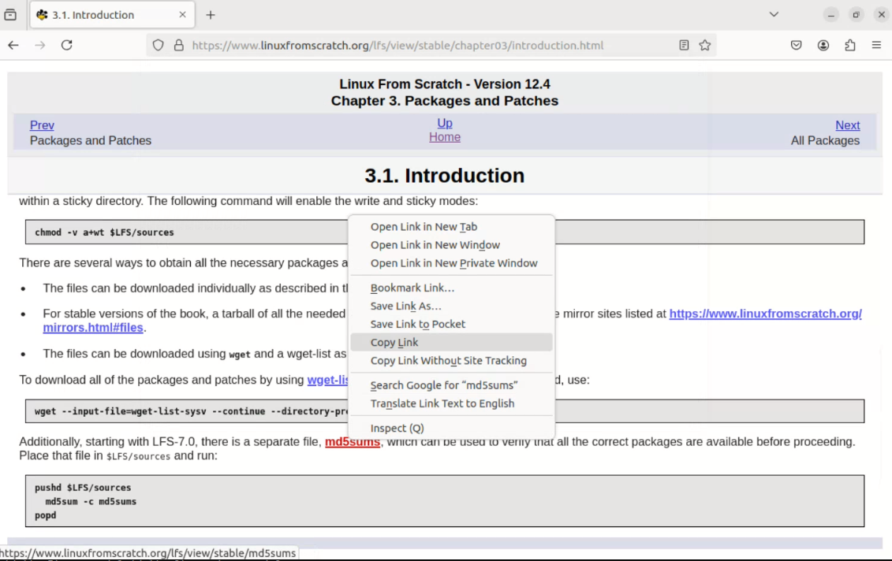</img>
</td>
</tr>
<tr>
<td width="50%" align="center" style="text-align:center;">
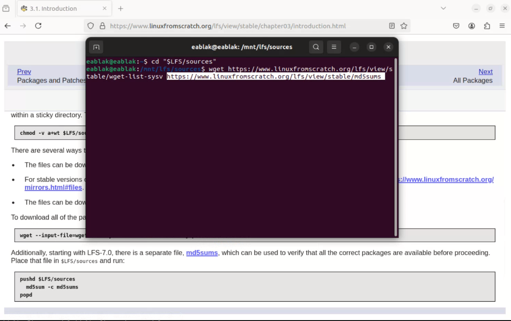</img>
</td>
<td width="50%" align="center" style="text-align:center;">
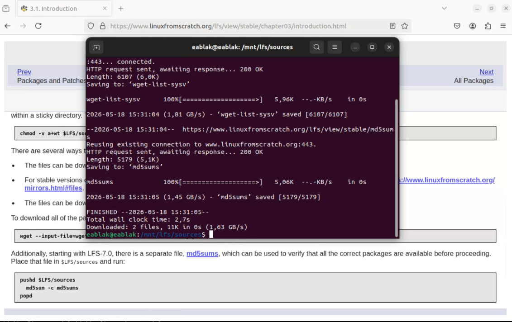</img>
</td>
</tr>
</table>
<br>

That should fetch those two files and place them in this current directory. To check it:

<p align="center">
  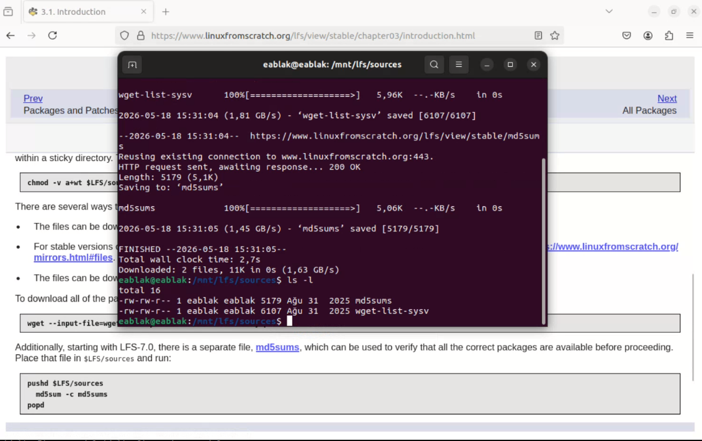</img>
</p>


To download all of the packages and patches by using wget-list-sysv as an input to the wget command, use:

```bash
wget --input-file=wget-list-sysv --continue --directory-prefix=$LFS/sources
```
<p align="center">
  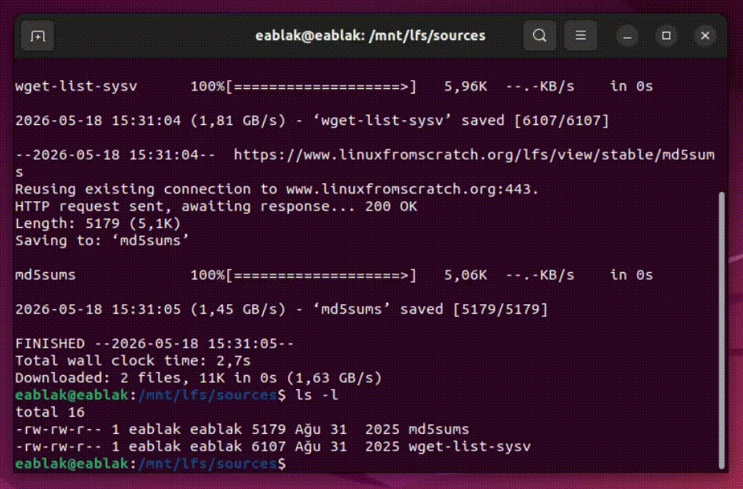
</p>
<br>


After installation finish run these commands to validate those downloads againts the MD5 sums file.

```bash
pushd $LFS/sources
  md5sum -c md5sums
popd
```
<table align="center">
<tr>
<td width="50%" align="center" style="text-align:center;">

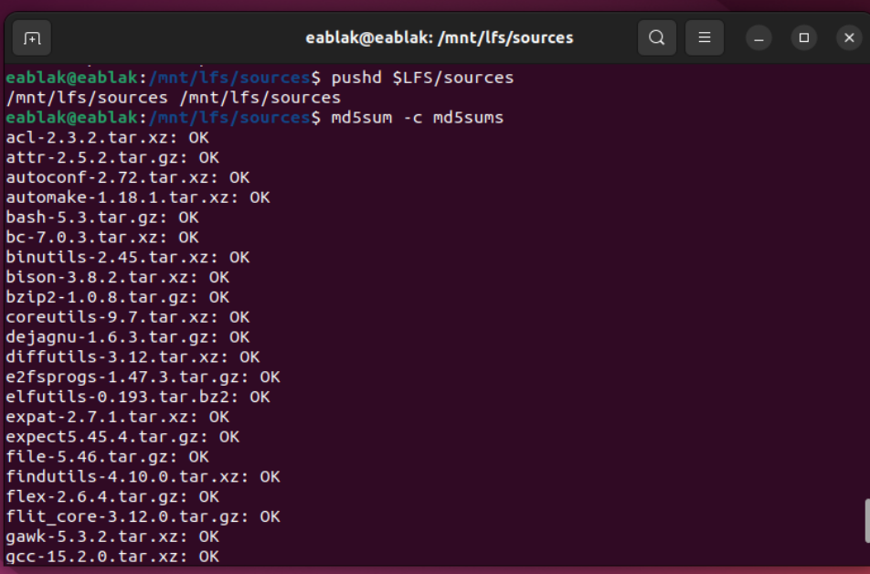</img>
</td>
<td width="50%" align="center" style="text-align:center;">
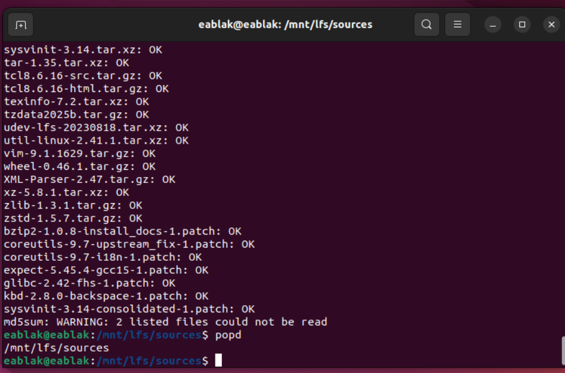</img>


</td>
</tr>
</table>

In my case 2 file can't load. So i copy their link and install them manually. And after it all files are OK.

<p align="center">
  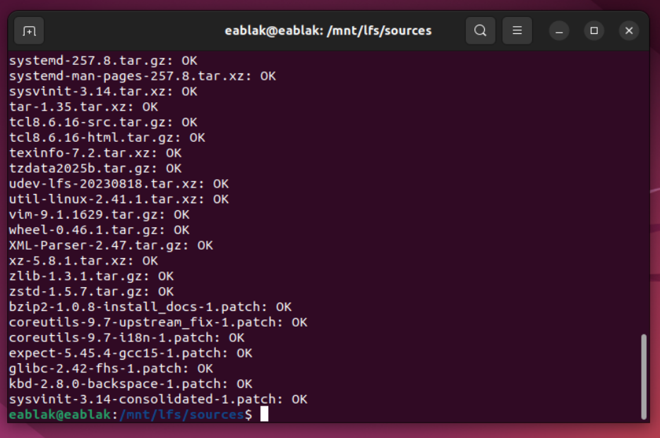</img>
</p>
