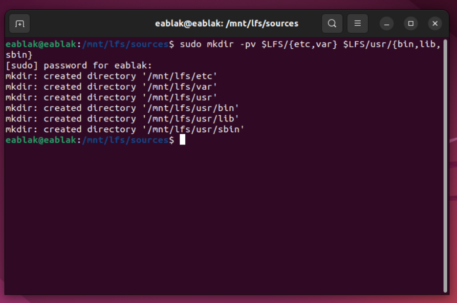
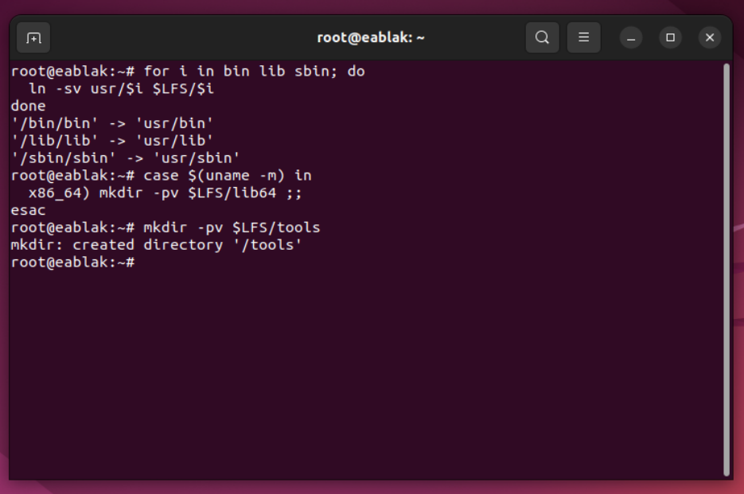
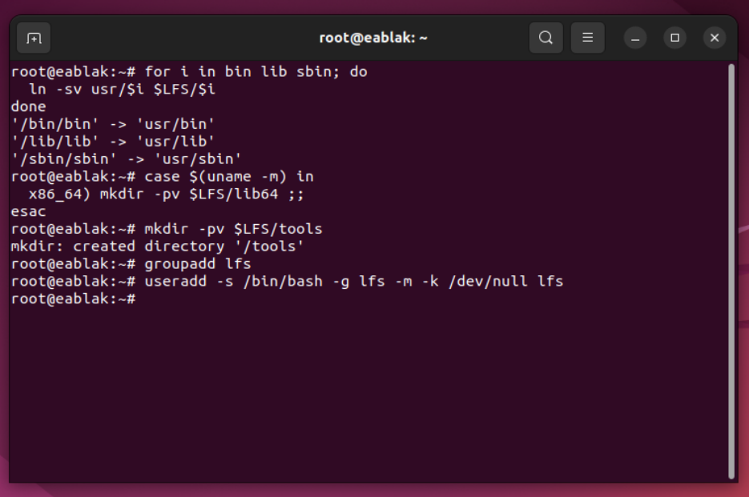
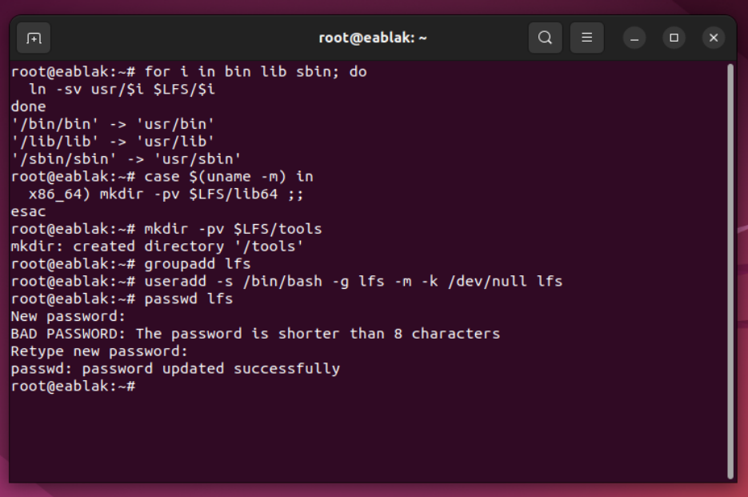
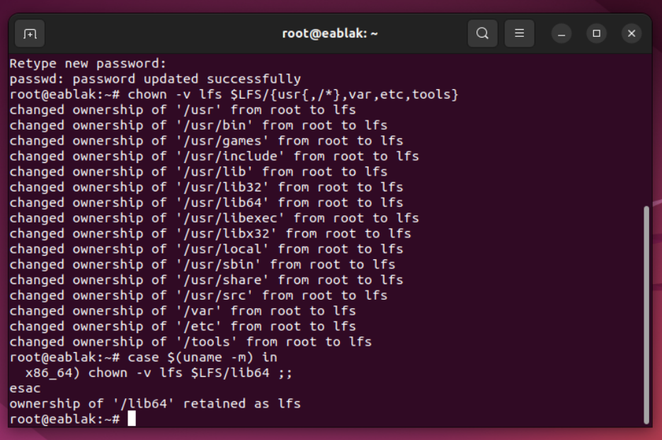
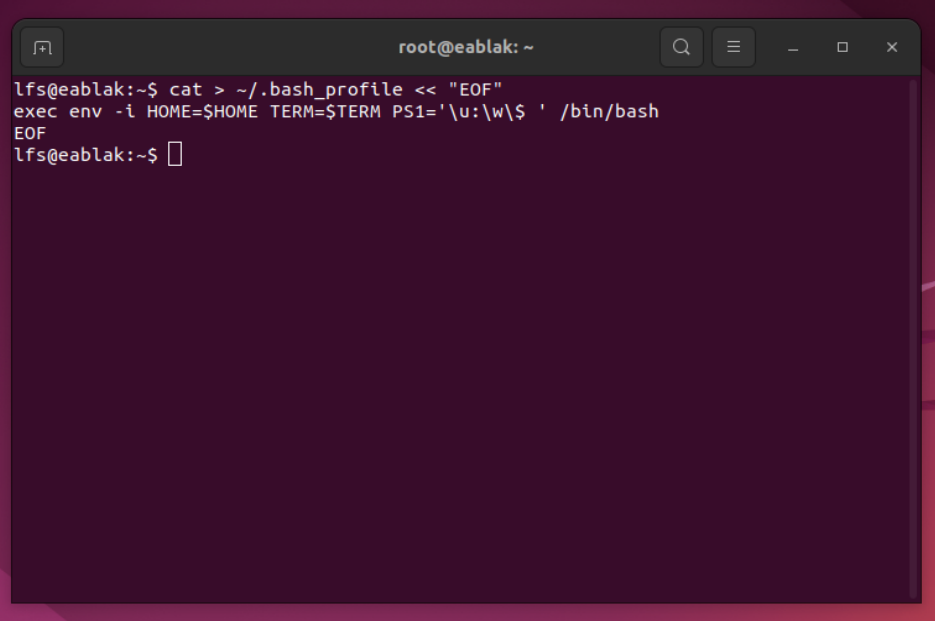
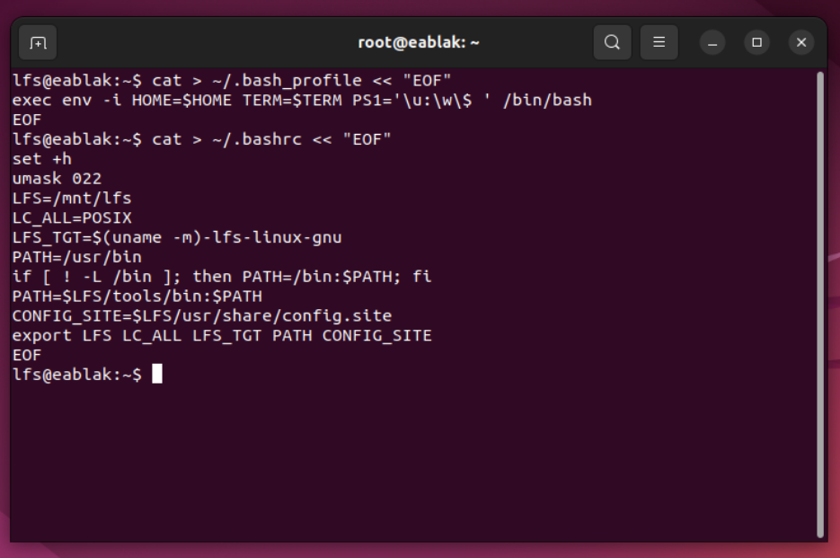
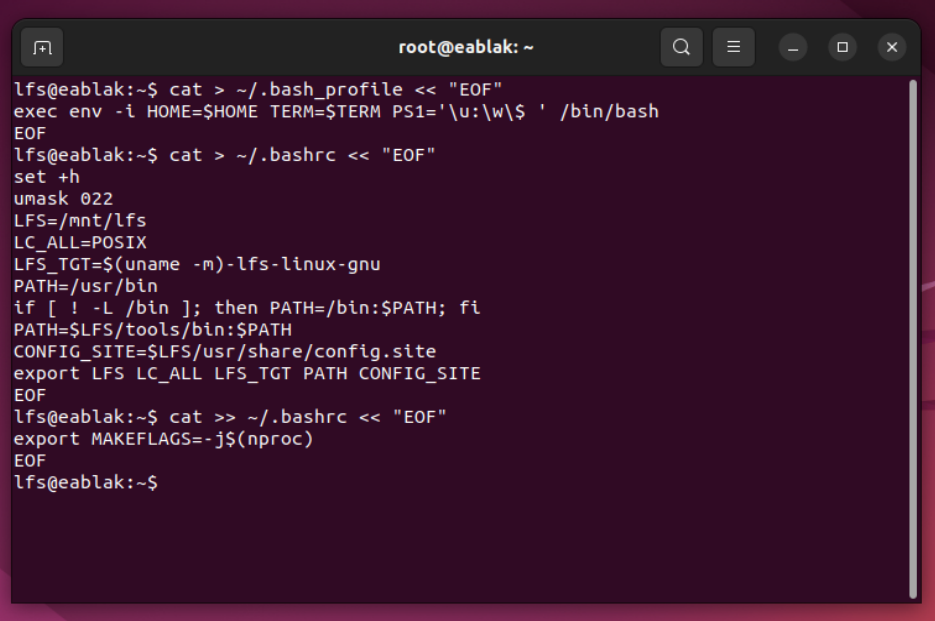
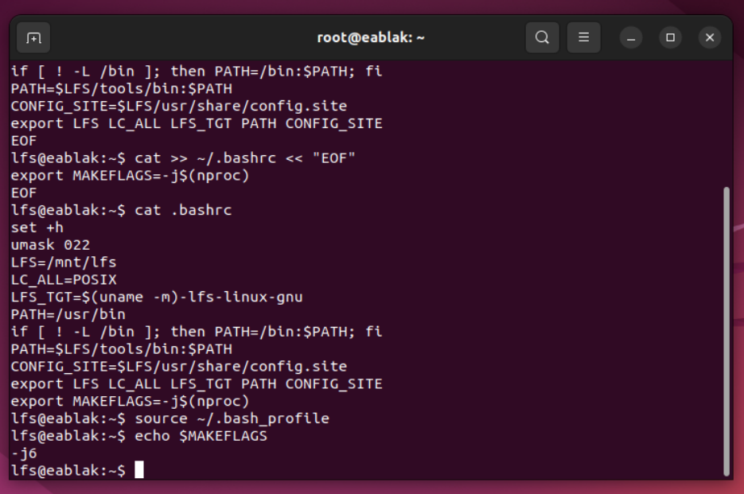

This documentation created accordingly [Linux From Scratch Handbook.](https://www.linuxfromscratch.org/lfs/view/stable/index.html) You can check that one to learn detailly.

# Preparing for the Build

## Chapter 4: Final Preparations

### Creating a Limited Directory Layout in the LFS Filesystem

What we want to do is prepare for building the temporary system. We will create a set of directories in $LFS (in which we will install the temporary tools), add an unprivileged user, and create an appropriate build environment for that user.

Create the required directory layout by issuing the following commands as root:


```bash
mkdir -pv $LFS/{etc,var} $LFS/usr/{bin,lib,sbin}

for i in bin lib sbin; do
  ln -sv usr/$i $LFS/$i
done

case $(uname -m) in
  x86_64) mkdir -pv $LFS/lib64 ;;
esac
```

Create that directory with this command:


```bash
mkdir -pv $LFS/tools
```

<table align="center">
<tr>
<td width="50%" align="center" style="text-align:center;">

</img>
</td>

<td width="50%" align="center" style="text-align:center;">

</img>

</td>
</tr>
</table>

### Adding the LFS User

When logged in as user root, making a single mistake can damage or destroy a system. We will create a new user called lfs as a member of a new group (also named lfs) and run commands as lfs during the installation process. As root, issue the following commands to add the new user:

```bash
groupadd lfs
useradd -s /bin/bash -g lfs -m -k /dev/null lfs
```

<p align="center">
  </img>
</p>

If you want to log in as lfs or switch to lfs from a non-root user, you need to set a password for lfs. Issue the following command as the root user to set the password:

```bash
passwd lfs
```

<p align="center">
  </img>
</p>

Grant lfs full access to all the directories under $LFS by making lfs the owner:


```bash
chown -v lfs $LFS/{usr{,/*},var,etc,tools}
case $(uname -m) in
  x86_64) chown -v lfs $LFS/lib64 ;;
esac
```

<p align="center">
  </img>
</p>

Start a shell running as user lfs.

```bash
su - lfs
```

### Setting Up the Environment

While logged in as user lfs, issue the following command to create a new .bash_profile:

```bash
cat > ~/.bash_profile << "EOF"
exec env -i HOME=$HOME TERM=$TERM PS1='\u:\w\$ ' /bin/bash
EOF
```

<p align="center">
  </img>
</p>


The new instance of the shell is a non-login shell, which does not read, and execute, the contents of the /etc/profile or .bash_profile files, but rather reads, and executes, the .bashrc file instead. Create the .bashrc file now:

```bash
cat > ~/.bashrc << "EOF"
set +h
umask 022
LFS=/mnt/lfs
LC_ALL=POSIX
LFS_TGT=$(uname -m)-lfs-linux-gnu
PATH=/usr/bin
if [ ! -L /bin ]; then PATH=/bin:$PATH; fi
PATH=$LFS/tools/bin:$PATH
CONFIG_SITE=$LFS/usr/share/config.site
export LFS LC_ALL LFS_TGT PATH CONFIG_SITE
EOF
```

<p align="center">
  </img>
</p>


Set MAKEFLAGS now in .bashrc:

```bash
cat >> ~/.bashrc << "EOF"
export MAKEFLAGS=-j$(nproc)
EOF
```

<p align="center">
  </img>
</p>

To ensure the environment is fully prepared for building the temporary tools, force the bash shell to read the new user profile:


```bash
source ~/.bash_profile
```

<p align="center">
  </img>
</p>
