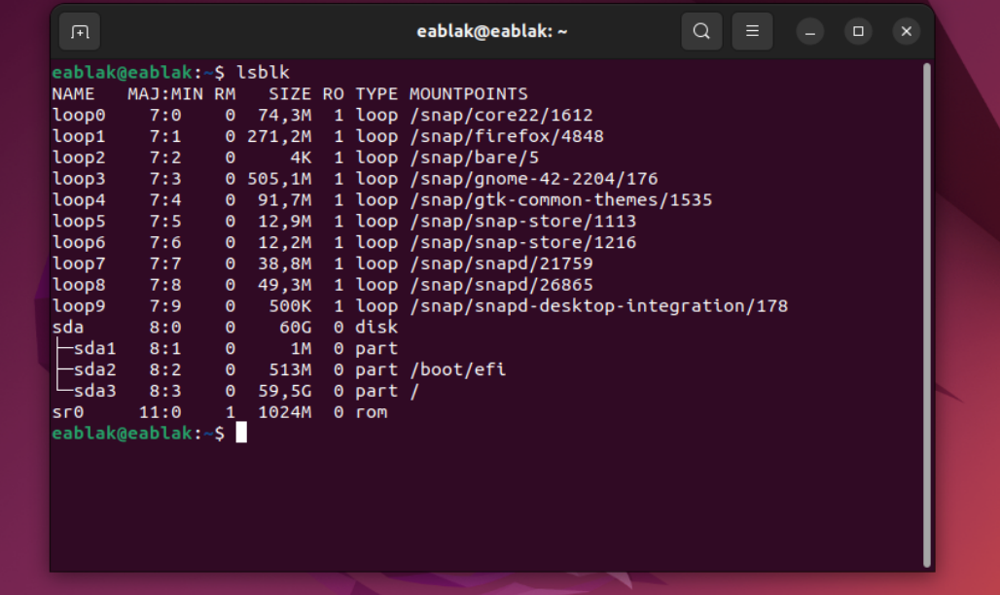
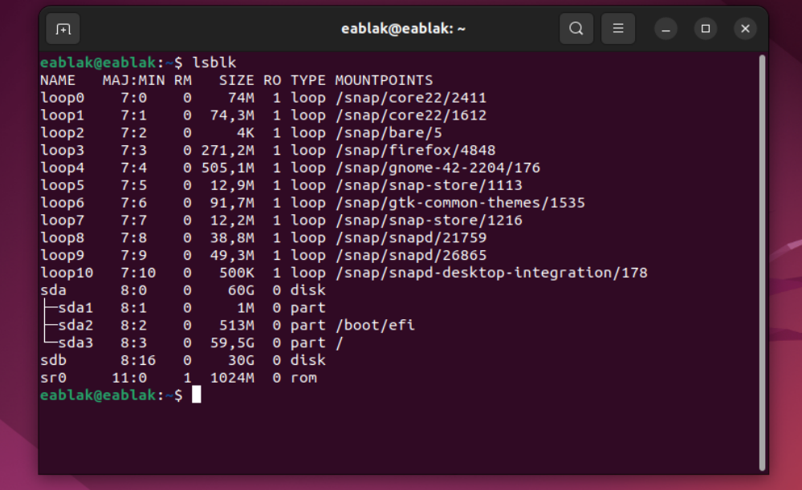
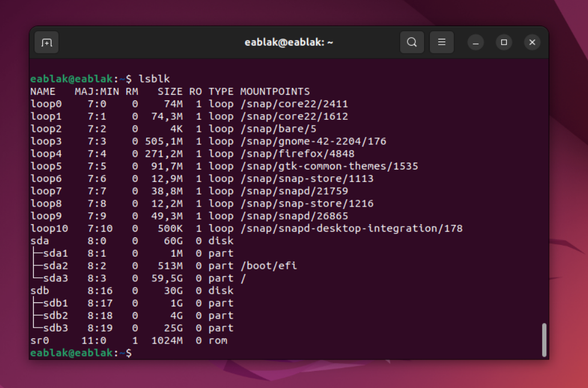
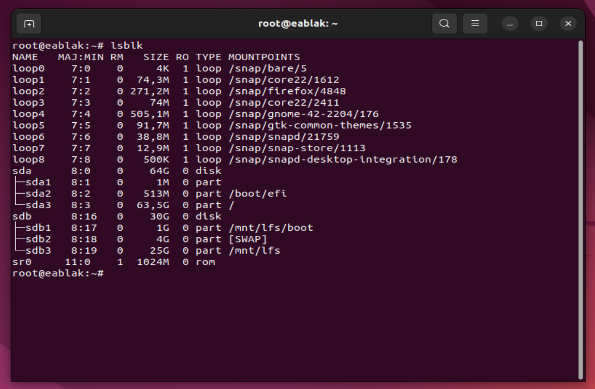

# Preparing for the Build

## Chapter2: Preparing the Host System

### Host System Requirements:


<b>Hardware</b>: The LFS editors recommend that the system CPU have at least four cores and that the system have at least 8 GB of memory.

<b>Software</b>: Your host system should have the  software with the minimum versions indicated in the book. To check my host system software requirements i run the [version-check.sh](https://www.linuxfromscratch.org/lfs/view/stable/chapter02/hostreqs.html) file and then update necessary packages which are giving error.

<table align="center">
<tr>

<td width="50%" align="center" style="text-align:center;">

<p style="text-align:center;">Before</p>
</td>

<td width="50%" align="center" style="text-align:center;">

<p style="text-align:center;">After</p>
</td>

</tr>
</table>

Now, you can start the build LFS.

### Building LFS in Stages

The book designed for built in one session. Therfore some non-permanent procedures needs to be repeated after reboot machine.

If you are in chapter 1-4:

```bash
export LFS=/mnt/lfs
```

Chapter 5-6:

```bash
export LFS=/mnt/lfs

sudo mount -v -t ext4 /dev/sdb1 $LFS
sudo su - lfs
```

Chapter 7-10:

```bash
export LFS=/mnt/lfs
mount /dev/sdb1 $LFS

chroot "$LFS" /usr/bin/env -i \
HOME=/root \
TERM="$TERM" \
PS1='(lfs chroot) \u:\w\$ ' \
PATH=/usr/bin:/usr/sbin \
/bin/bash --login
```

You don't need to do anything right now and this commands will be explained in later chapters. For now, just keep in mind to if you reboot your machine, repate non-premanent procedures.

### Creating a New Partition

<i>LFS is usually installed on a dedicated partition. The recommended approach to building an LFS system is to use an available empty partition or, if you have enough unpartitioned space, to create one.</i>

We have one combined virtual disk which is sda. I prefer to shrink it to two part; one is sda one is sdb. I will use sdb for LFS and create new partitions on that disk.

The reason for why i prefer this one because my host ubuntu is located on sda and i want to keep it safe. So i created sdb disk which is showing on right image in table.


<table align="center">
<tr>

<td width="50%" align="center" style="text-align:center;">

<p style="text-align:center;">Before</p>
</td>

<td width="50%" align="center" style="text-align:center;">

<p style="text-align:center;">After</p>
</td>

</tr>
</table>


You can check from [here](/readme/utils/shrink_disk.md) to how i did this shrink disk process.

So create a necessary partitions for this new sdb disk. We will create root, /boot and swap.

#### 1. The Root Partition (/)

The root partition contains, by default, all your system files, program settings, and documents. The root filesystem is the top-level directory of the filesystem hierarchy. It contains all the essential components needed to boot, restore, recover, and repair the system.

#### 2. The Swap Partition (/swap)

Swap space is your system's safety net when it runs low on RAM (Random Access Memory). Swap is disk-backed space the kernel uses when it cannot keep all memory pages in RAM. When physical memory runs low, the kernel may write cold pages to swap so active workloads keep RAM. Reads and writes to swap are slower than RAM, so swap is a safety net — not a substitute for having enough RAM.

#### 3. The Boot Partition (/boot)

The /boot directory contains the files needed to boot the system. For example, the GRUB bootloader's files and your Linux kernels are stored here.

Use [fdisk](https://man.archlinux.org/man/fdisk.8) command for manipulate disk partition table. Start with boot:

<p align="center">
  
</p>
<br>

Your /boot partition succesfully created and result is /dev/sdb1. In a same way you have to create your swap partition but after the creation of swap partition you have to change the type. You have to change type with "-t" option and use "L" for list of types. After i type -t i list my types with L and in the list Linux swap is 19. So here is the steps:

<p align="center">
  
</p>
<br>

After created boot and swap lastly we have to create our root. With a same steps i create my root partition but this time i give my rest of size for root.

<p align="center">
  
</p>
<br>

Finally when i see my 3 partition created sucessfully i write (save) them to disk.

<table align="center">
<tr>
<td width="50%" align="center" style="text-align:center;">

</img>

</td>
<td width="50%" align="center" style="text-align:center;">




</td>
</tr>
</table>


### Creating a File System on the Partition

After creating partitions, the next step is to format them with a file system and mount them so they can be used for storing data. Without a file system, a partition cannot store or organize files.

A <b>file system</b> is a method used by Linux to store and organize data on a disk.

Linux uses file systems like ext4, ext3, XFS, and FAT to organize and store data on disks. Use the mkfs (make file system) command to format partitions with your chosen file system.​

```bash
# /boot
sudo mkfs -v -t ext4 /dev/sdb1

# /
sudo mkfs -v -t ext4 /dev/sdb3

# swap
sudo mkswap /dev/sdb2
```

### Setting the $LFS Variable and the Umask

Follow the [chapter](https://www.linuxfromscratch.org/lfs/view/stable/chapter02/aboutlfs.html) for commands.

### Mounting the New Partition

The partition must be mounted so the host system can access it. Accordingly my mutliple partitions here is my mounting commands:


```bash
mkdir -pv $LFS
mount -v -t ext4 /dev/sdb3 $LFS # /

mkdir -pv $LFS/boot
mount -v -t ext4 /dev/sdb1 $LFS/boot # /boot

chown root:root $LFS
chmod 755 $LFS

swapon -v /dev/sdb2 # /swap
```

Here is the result:
<p align="center">
  
</p>