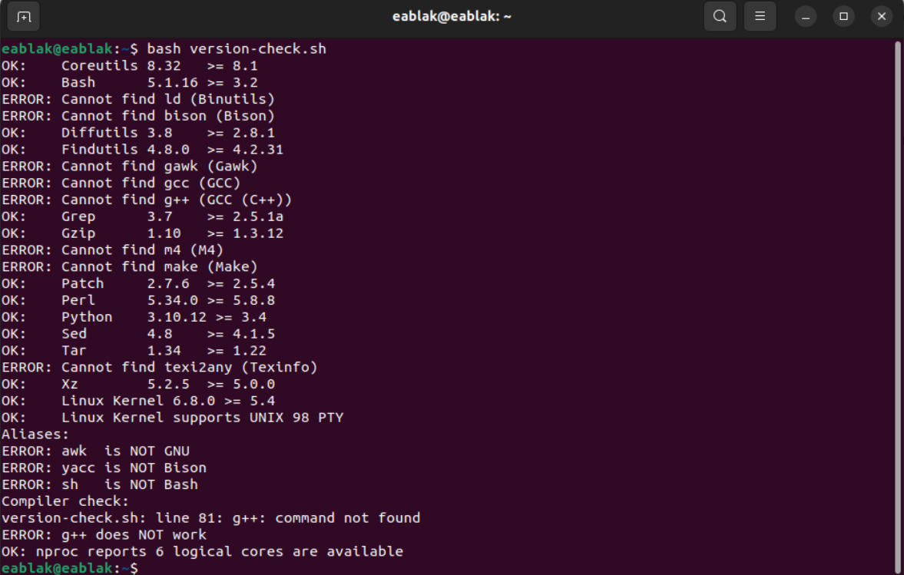
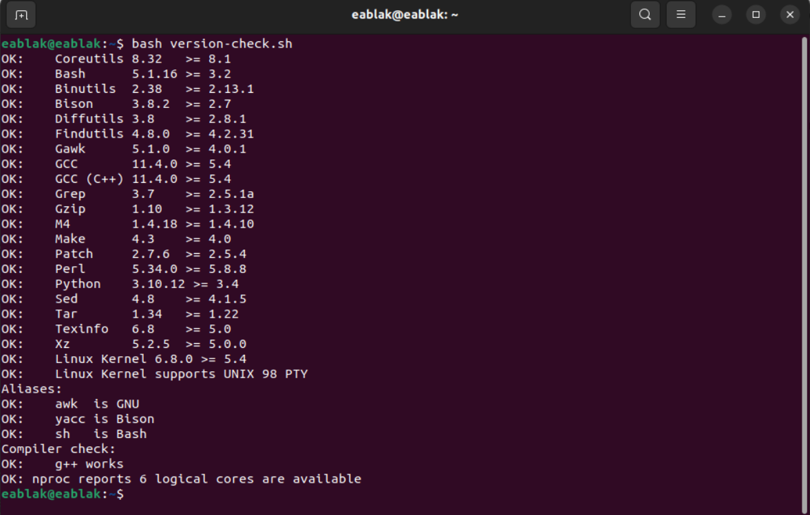

This documentation created accordingly [Linux From Scratch Handbook.](https://www.linuxfromscratch.org/lfs/view/stable/index.html) You can check that one to learn detailly.

# Preparing for the Build

## Chapter 2: Preparing the Host System

In ft_linux project our goal is to have our own LFS system. To be able create that one i prefer to use virtual machine. So in my virtualbox i set up ubuntu 22. I will use this ubuntu 22 for my host machine anymore.

This new host machine needed for building LFS! In this host machine, will create partition itself, create a file system on it and mount it. All this steps will explained step by step in a continuous sections..

### Host System Requirements:

Firstly we have to be sure our host has enough requirements. To check my host system requirements i run the [version-check.sh](https://www.linuxfromscratch.org/lfs/view/stable/chapter02/hostreqs.html) file and then update necessary packages which are giving error.

<table align="center">
<tr>
<td width="50%" align="center" style="text-align:center;">

Before

</td>
<td width="50%" align="center" style="text-align:center;">

After

</td>
</tr>
</table>

### Creating a New Partition:

We have to create our partitions for lfs. <i>"You must use at least 3 different partitions: root, /boot and a swap partition."</i>  So to create partitions lets check what is our current distro (left image).

We have one combined virtual disk which is sda. I prefer to shrink it to two part one is sda one is sdb. I will use sdb for lfs and create new partitions that disk.

The reason for why i prefer this one because my host ubuntu is located on sda and i want to keep it safe. So i created sdb disk which is showing on right image in table.

You can check from [here](/readme/utils/shrink_disk.md) to how i did this shrink disk process.

<table align="center">
<tr>
<td width="50%" align="center" style="text-align:center;">

Before

</td>
<td width="50%" align="center" style="text-align:center;">

After

</td>
</tr>
</table>

Now continue for <b>create partitons.</b> We will create root, /boot and swap.

<b>root:</b>

- In linux, everything begins at the root directory, represented by a "/". It's the top-level folder from which all other files and directories descend. Think of like the trunk of like a tree. Unlike Windows, which uses seperate drive letters (C:\, D:\, E:\,), Linux has a single unified file system and everything connects back to root, including external drives and partitions.

- You might also see /root, but don't confuse it with /. / is starting point of the entire system, while /root is just a sub directory. It's the personal home folder of the root user, who has full administrative access. In other words, / is the starting point of the file system, while /root is just one of the many folders inside it. This seperation helps maintain a clean and secure system structure.

<b>/boot:</b>

- This folder contains all the files your system needs to boot up, like Linux kernel, initial RAM disk (initrd or initramfs) and the GRUB bootloader files.

- One important file here is grub.cfg, which tells the system how to load the operating system. In some setups, especially in dual-boot systems or when disk encyrption is used, /boot might even be placed on its own seperate partition to be sure it stays accessible during startup.

<b>swap:</b>

- Linux divides its physical RAM into chunks of memory called pages. Swapping is the process whereby a page of memory is copied to the preconfigured space on the hard disk, called swap place, to free up that page of memory. The combined sizes of the physical memory and the swap space is the amount of virtual memory available.

We will use "fdisk" command for manipulate disk partition table. Start with boot:

  <video src="../readme_images/readme_mp4/boot.mp4" width="80%" style="border-radius:12px;" controls></video>

 
Your /boot partition succesfully created and result is /dev/sdb1. In a same way you have to create your swap partition but after the creation of swap partition you have to change the type. You have to change type with "-t" option and use "L" for list of types. After i type -t i list my types with L and in the list Linux swap is 19. So here is the steps:

  <video src="../readme_images/readme_mp4/swap.mp4" width="80%" style="border-radius:12px;" controls></video>

 

And after created boot and swap lastly we have to create our root. With a same steps i create my root partition but this time i give my rest of size for root.

  <video src="../readme_images/readme_mp4/root.mp4" width="80%" style="border-radius:12px;" controls></video>

 

Finally when i see my 3 partition created sucessfully i write (save) them to disk.

<table align="center">
<tr>
<td width="50%" align="center" style="text-align:center;">

<video src="../readme_images/readme_mp4/save_partitions.mp4" width="100%" style="border-radius:12px;" controls></video>

</td>
<td width="50%" align="center" style="text-align:center;">

</td>
</tr>
</table>