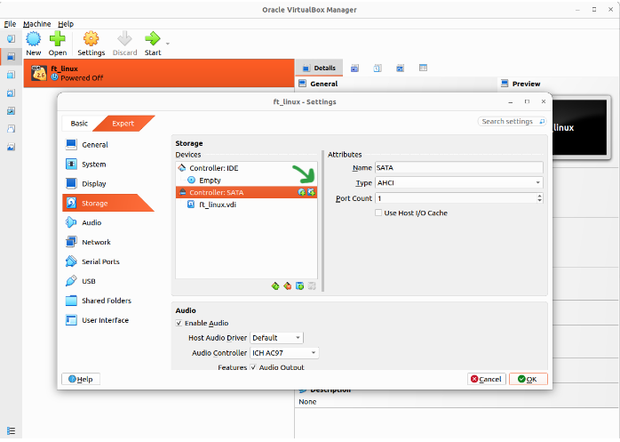
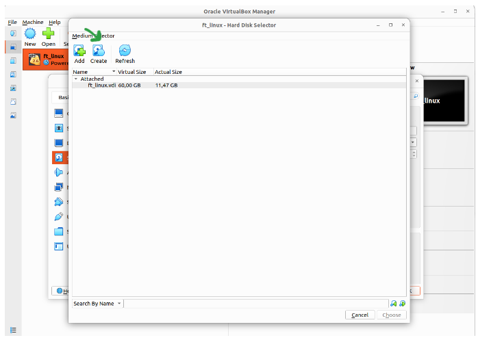
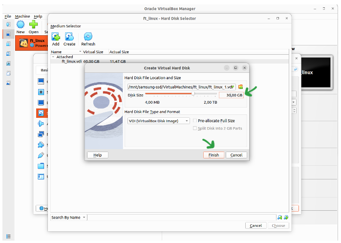
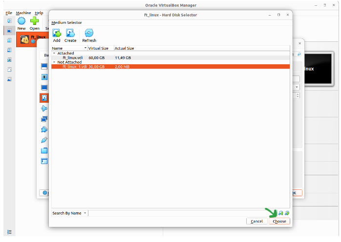
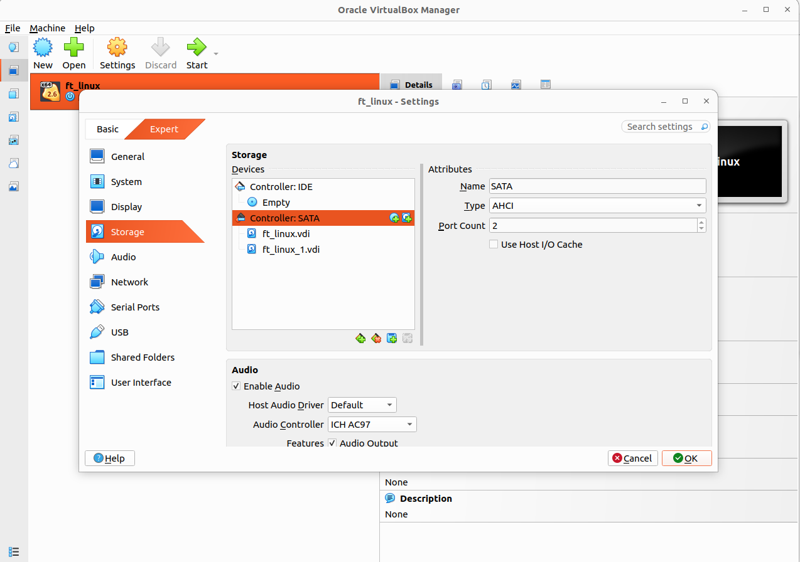

<b>Shrink disk steps:</b>

<table align="center">
<tr>
<td width="70%" align="center">

</td>

<td width="30%" align="center">

Open your virtual machine settings (while its not running) and click to "add a hard disk" icon.
</td>
</tr>
</table>

<table align="center">
<tr>
<td width="30%" align="center">

Click to create.
</td>

<td width="70%" align="center">

</td>
</tr>
</table>

<table align="center">
<tr>
<td width="70%" align="center">

</td>

<td width="30%" align="center">

Give your size first and then click to finish.
</td>
</tr>
</table>

<table align="center">
<tr>
<td width="30%" align="center">
Now your new disk is created but not attached. So choose your new disk and click yo create button.
</td>

<td width="70%" align="center">

</td>
</tr>
</table>

<table align="center">
<tr>
<td width="70%" align="center">

</td>

<td width="30%" align="center">
Here is the final result how its looks.
</td>
</tr>
</table>